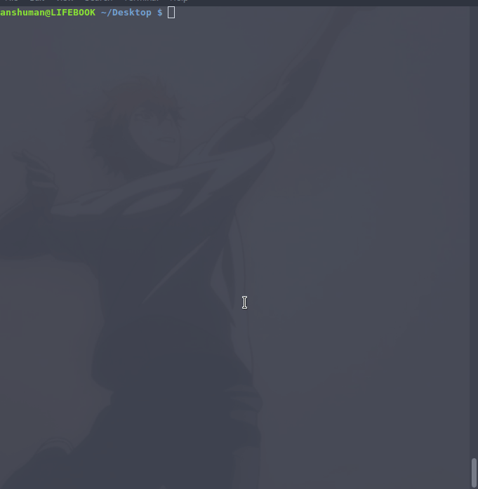

<p align="center">

</p>

<h1 align="center"> web2desktop </h1>
<p align="center">


</p>

<p align="center">A cli tool which scaffolds out an electron app using WebView</p>

## Demo
<p align="center">
	
</p>

## Usage

#### Install the module globally

```
$ sudo npm i -g web2desktop
```

#### Initiate the app

```
$ web2desktop
```

Fill in the required fields and the app is generated! :tada:

#### Start

```
$ npm start
```

## Uses

The handlebars template which is scaffolded out is [here](https://github.com/anshumanv/electron-webview-template)

## Author

[Anshuman Verma](https://github.com/anshumanv)

[](https://twitter.com/Anshumaniac12)
[](https://linkedin.com/in/anshumanv12)


## Contribute

Found a bug, please [create an issue](https://github.com/anshumanv/web2desktop/issues/new)

